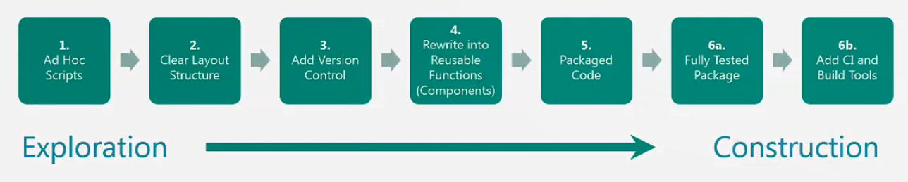
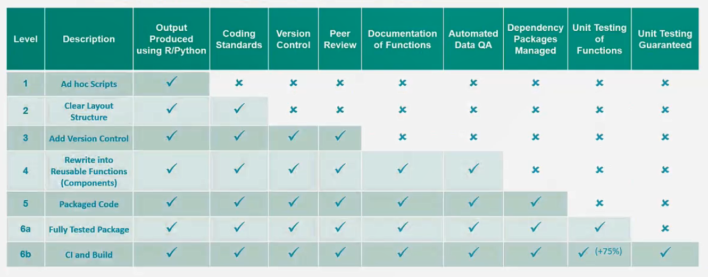

::: {.breadcrumbs}
* [Articles](articles.html)
* Levels of RAP discussion
:::

# Levels of RAP discussion

The community is discussing whether to have different levels of what makes a RAP
project.  There will be a session on this topic at the next RAP Champions Meetup
on 28 May 2019.

* [GitHub issue](https://github.com/ukgovdatascience/rap-website/issues/25)
* [NHS Scotland guidance](https://www.isdscotland.org/About-ISD/Methodologies/_docs/Reproducible_Analytical_Pipelines_paper_v1.4.pdf)
* [Draft guidance for this website](https://docs.google.com/document/d/1LA0xkCj6G8lEezAYfBGlKgsKNiISofh0eNEg6126CXU/edit)

The diagrams below are from the ONS Data Access Platform team via Martin Ralphs.
The diagrams are also described in text below.

The first diagram describes seven levels of RAP along a scale from exploration
to construction:

1. Ad hoc scripts
2. Clear layout structure
3. Add version control
4. Rewrite into reusable functions
(components)
5. Packaged code
6.
  a. Fully tested package
  b. Add CI and build tools

The second diagram describes the same seven levels of RAP along with more detail
about how each level could be achieved.

1. Output Produced using R/Python
2. Coding standards
3. Version control and peer review
4. Documentation of functions and automated data QA
5. Dependency packages managed
6.
  a. Unit testing of functions
  b. Unit testing guaranteed
